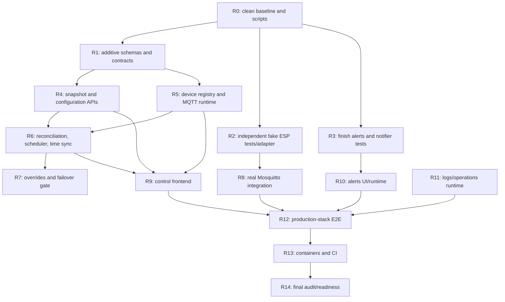

# AquariumController remaining-work plan

Updated: 2026-07-12  
Planning baseline: commit `7906b64` (`WIP`) on `codex/aquarium-rewrite`  
Purpose: handoff plan for completing the rewrite with ordinary Codex mode.

This document is the execution plan for all work that remains before the
repository is locally ready to replace the legacy controller. It is deliberately
more prescriptive than `architecture.md`: future tasks should implement these
decisions instead of reopening them unless evidence proves a decision unsafe.

The production aquarium, Raspberry Pi, production broker, credentials, GitHub
settings, and production data remain out of scope during implementation.

## 1. Completion boundary

Repository work is complete only when the only remaining actions are:

1. Run the finished importer against real production data on the Pi.
2. Configure GitHub settings, secrets, environments, and runners.
3. Configure the Pi and production MQTT/database paths.
4. Deploy locally verified artifacts.
5. Configure the selected real alert destination.

The following stay explicitly deferred:

- The sketch5 dashboard and its switches, countdowns, timers, and sensors.
- DSL dosing and pump-calibration workflows described only in old TODO files.
- Direct Pi sensors, USB Arduino support, remote access, Tailscale, and public
  HTTPS.
- Actual production-data migration, Pi configuration, flashing devices, and
  GitHub configuration.
- Kill, shutdown, reboot, git-pull, and self-update HTTP endpoints.

## 2. Non-negotiable safety rules

Every delegated task must follow these rules:

- Never contact, scan, ping, browse, or resolve aquarium/LAN devices.
- Never connect to the legacy broker at `192.168.1.73` or any host copied from
  `.old`.
- Network tests may use only loopback or a test-created Docker network.
- Running development/tests may use only `test/aquarium/*`. Production topic
  strings may appear in source and pure tests but may not be used by a test
  client.
- MQTT stays disabled by default. Production MQTT requires production mode,
  an explicit broker, the production namespace, and the exact confirmation
  guard already defined in `configuration.ts`.
- Treat `.old/**` as read-only. Do not modify ESP firmware without a separate,
  explicit user approval. Do not flash anything.
- Never read or modify `.env` files. Document variables by name and ask the
  operator to set values.
- Never push. Commit only coherent milestones after their relevant checks pass.
- Preserve unrelated user changes. Do not use destructive Git commands.
- Timeout or interrupted QoS 0 publication means actuator outcome is unknown;
  never retry blindly.
- Do not weaken a guard, validation rule, or test to make a suite pass.

## 3. Settled architecture decisions

These decisions are closed unless implementation evidence exposes a safety
problem.

### Runtime and frameworks

- Node.js 24 LTS, npm 11, strict TypeScript 5.9.
- One Fastify modular-monolith controller owns HTTP, SSE, MQTT, scheduling,
  persistence, alerts, and adapters.
- React 19 + Vite + React Router + TanStack Query provide a local SPA.
- Mosquitto remains a separate process/container.
- Zod validates every untrusted boundary and every versioned persisted JSON
  document on both write and read.
- SQLite uses Kysely and `better-sqlite3`; do not add a network database.

### Database representation

`state.db` is authoritative and relational. Devices, mapping profiles, pin
mappings, outputs, channels, schedules, points, throttles, overrides,
operations, alerts, and migration metadata are rows with constraints and
indexes. They must never be collapsed into a large JSON document.

JSON columns are limited to genuinely variable or wire-shaped documents:

- Typed event payload/details.
- Firmware metadata and compiled firmware schedule payloads.
- Versioned rule-specific configuration.
- DSL diagnostics/source metadata for the deferred extension point.
- Import reports and diagnostics.

Each JSON column must have a schema-version partner, use a specific Zod schema,
reject duplicate keys where raw JSON text enters the system, and validate again
when read. Frequently queried properties remain ordinary indexed columns.

`events.db` is separate so event retention and archive work cannot endanger
control state. Cross-database atomic commits are forbidden: a state mutation
commits its revision and outbox row in `state.db`, then the dispatcher mirrors
the event idempotently into `events.db`.

### Logging, storage, and compression

- Pino process/service logs go to stdout. Production Compose uses capped,
  rotated, compressed container logs.
- Queryable MQTT, scheduler, device, mutation, alert, and error interactions go
  to structured `events.db` rows through `InteractionRepository`.
- Secrets and sensitive keys are redacted before persistence; payload hashes
  are calculated after redaction.
- Critical/audit data is durable. High-volume raw traffic has short retention,
  aggregate summaries, byte budgets, and optional archive-before-delete.
- Event archives are deterministic NDJSON compressed with Node 24 native
  Zstandard. Checksum, byte counts, schema version, and database status must be
  verified before source rows can be removed.
- `state.db` and `events.db` use independent SQLite online backups with a
  manifest, SHA-256, and SQLite integrity check. Restore never overwrites an
  existing path and is performed during a controlled outage.
- Storage projection targets no more than 10 GB/year. Over-budget state,
  retention failure, archive failure, backup failure, and low disk space feed
  the alert system.

### CI and deployment

- Pull-request code never runs on a Pi runner.
- CI order is static checks/unit tests, real-broker integration, browser E2E,
  production build, then container/ARM64 smoke checks.
- Main may publish an immutable multi-architecture image to GHCR after GitHub
  settings are configured externally.
- A future protected deploy job may run only on an explicitly configured Pi
  runner/environment and is not part of this repository-completion phase.
- Production LAN traffic is plain HTTP. Do not recreate application-managed
  certificates.

## 4. Current repository inventory

### Substantially implemented and unit-tested

- Workspace, strict TypeScript, format/lint/typecheck/build foundation.
- Configuration parsing and development/test/production MQTT safety guards.
- Normalized STRICT SQLite schemas, WAL settings, constraints, indexes, and
  initial migrations for `state.db` and `events.db`.
- Atomic state revision/outbox commits and idempotent mirror into `events.db`.
- SSE formatting, replay, Last-Event-ID precedence, watermark/gap detection,
  transient heartbeats, resync-required, and bounded-client behavior.
- Strict duplicate-key-aware JSON parsing.
- Legacy fixture analyzer, deterministic report, read-only dry run, atomic
  valid import, duplicate protection, and CLI. Current `.old/data` correctly
  produces 35 fatal findings and no committed rows.
- Canonical schedule graph validation/evaluation, legacy compatibility
  evaluation, half-even rounding, throttle compilation, compact serialization,
  `syncTime` placement, size checks, and unsigned DJB2 hashing.
- Legacy MQTT transport state machine: MQTT 3.1.1 options, QoS 0/non-retained,
  subscribe-before-discover, one global queue, batching, chunk publication,
  response correlation, and fail-closed outcome-unknown behavior.
- Structured interaction storage, redaction, Zstandard archives, retention,
  aggregation, byte usage/projection, and safe SQLite backup/restore primitives.

### Code exists but is not yet a completed feature

- `packages/fake-esp` contains a sizeable independent actor, clock,
  persistence, and in-memory bus, but has no tests and no real MQTT.js adapter.
- Alert service and webhook notifier code exist, but there are no alert tests,
  no persisted delay state, no delivery orchestration, and no runtime wiring.
- Server opens/migrates both databases and runs the outbox mirror, but it
  intentionally throws if MQTT is enabled.
- Browser SSE code exists, but there is no state snapshot API and no committed
  event/query invalidation workflow.
- Retention and backup primitives are not scheduled or exposed as safe
  operational commands.

### Missing end-to-end surfaces

- No authoritative snapshot or mutation HTTP API beyond health/SSE.
- No device registry, announcement persistence, reconciliation coordinator,
  five-second output scheduler, time-sync coordinator, or manual override use
  case.
- No logs query/export API.
- The UI shows only three links; all control pages, logs, and admin are
  placeholders. There are no web unit tests.
- No Testcontainers Mosquitto test, Playwright test, Dockerfile, Compose stack,
  fake-device launcher, or ARM64 smoke test.
- CI is only `npm ci` followed by `npm run check`.

### Baseline caveat

The previous session reported 102 passing tests, successful typechecking,
linting, and builds. This planning turn did not rerun them. Phase R0 must
establish the reproducible baseline from a clean checkout before feature work.

## 5. Blocker and decision gates

### Gate D1: Docker/Testcontainers

Required before real-broker integration, production Compose, E2E, or ARM64
verification:

```powershell
& "C:\Program Files\Docker\Docker\resources\bin\docker.exe" version
```

Both Client and Server sections must succeed. Previously the Desktop Linux pipe
returned permission denied because `com.docker.service` was stopped and Codex
could not obtain elevation. The operator may start Docker Desktop elevated or
resume after elevation approval is available. Do not substitute a mocked
broker; native Mosquitto may be used only for diagnostics, not as the required
Testcontainers evidence.

Stop condition: if Docker still cannot run after ordinary documented setup,
record the exact error and stop the integration/container lane. Other lanes may
continue only if the user asks to proceed around that natural blocker.

### Gate D2: deployed-firmware failover defect

The current ESP firmware may not restore a flat scheduled output after a
120-second override expires because the physical pin changes while
`activeChannels.currentValue` remains equal to the scheduled target. A server
cannot fix sudden-controller-death behavior.

Before declaring replacement readiness, the independent fake must reproduce
this behavior in a focused test. Then request one explicit decision:

1. Approve a minimal firmware reliability change, compile/test it, retain wire
   compatibility, and leave flashing/rollout as an external task; or
2. Explicitly accept the failover limitation and keep readiness blocked/noted.

Do not edit the sketch while implementing the rest. If approval is later given,
the smallest candidate fix is to invalidate the matching cached scheduled
value when an override expires so the next schedule loop necessarily writes;
the exact change still requires firmware-focused review and tests.

### Gate D3: legacy fixture validity

The development fixtures are intentionally invalid. This does not block tool
development. Do not alter `.old/data` to make import green. Unit tests use a
separate valid fixture for commit behavior and assert the real fixture report.

Production import remains an external execution step. Any production dry-run
errors must stop deployment; no silent repair is permitted.

## 6. Dependency and delegation map



Safe parallel lanes after R0:

- R1 schemas/contracts, R2 fake ESP, and R3 alerts may run in parallel because
  they should touch separate files. Coordinate `package.json` and
  `package-lock.json` changes serially.
- R4 API and R5 MQTT runtime may run in parallel only after contracts and
  migrations stabilize. Assign ownership of `server.ts`, `app.ts`, and shared
  contracts to one task at a time.
- Frontend work starts only after snapshot/mutation contracts stop moving.
- R8, R12, and R13 require Docker gate D1.

## 7. Standard task protocol

Use one bounded Codex task per work package below. Ordinary mode is appropriate
for most packages; reserve higher reasoning (not Ultra unless the user chooses)
for R6-R8 and final safety review.

Every task prompt should begin with:

> Read `AGENTS.md`, `docs/remaining-work-plan.md`, `docs/architecture.md`, and
> `docs/feature-parity.md`. Work only on package Rn. Never access the Pi/LAN,
> production broker/data, `.env`, or modify `.old`. Use test MQTT topics only.
> Preserve unrelated changes, update parity evidence, run focused checks, and
> commit only if the package is coherent and green. Never push.

Every package must end with:

- A list of files changed and decisions made.
- Exact commands/tests run and their results.
- Relevant parity-matrix rows updated; do not claim `Implemented` without all
  listed unit, real integration, and browser evidence.
- No skipped/only tests, weakened assertions, generated DBs/logs, or secrets.
- A coherent commit when all relevant checks pass; otherwise leave a clear
  handoff and do not make a misleading commit.

## 8. Work packages

### R0 — Re-establish a clean, reproducible baseline

Effort: small. Dependencies: none. Suggested mode: ordinary.

Tasks:

- Verify Node 24/npm 11 and Docker gate D1 without contacting any remote/LAN
  service.
- From a clean checkout run `npm ci`, then `npm run check`.
- Fix any formatting drift; do not change behavior merely to make checks green.
- Add `@aquarium/fake-esp` to `build:packages`; ensure the lockfile contains all
  workspace links and `npm ci` does not modify it.
- Split scripts into stable lanes:
  - `test:unit`
  - `test:integration`
  - `test:e2e`
  - `test:critical`
  - `verify` (all required checks)
  - `stack:test:up`, `stack:test:down`, and `stack:test:status` later filled by
    R13.
- Update README claims that still call SQLite/MQTT “next milestone.”
- Do not rewrite the `WIP` commit. Make a new coherent baseline-cleanup commit
  if changes are needed.

Acceptance:

- Clean checkout: `npm ci` leaves Git clean.
- `npm run check` passes.
- All five workspaces typecheck/build, including fake ESP.
- Test scripts do not inadvertently run Docker or browsers in the unit lane.

### R1 — Additive runtime migrations and stable HTTP/event contracts

Effort: medium. Dependencies: R0. Suggested mode: ordinary with careful schema
review.

Do not edit `001` migrations in place. Add tested `002` migrations so upgrade
from the current committed schema is evidence.

State additions to evaluate and implement:

- `device_schedule_artifacts`: device, source state revision, desired hash,
  compiled payload JSON + schema version, byte count, compile/delivery status,
  timestamps, and indexed desired/reported reconciliation fields.
- `scheduler_guards`: persisted daily UTC job key/day/last-success metadata for
  time sync and maintenance without duplicate restart bursts.
- `alert_condition_states`: persisted pending-since/last-observed condition so
  alert delays survive controller restart; replace the alert service's in-memory
  `pendingConditions` map as authority.
- `notification_deliveries`: alert transition, destination kind, status,
  attempt/dedup key, timestamps, and last error. It must not become an
  unbounded automatic retry queue.

Add or tighten indexes/checks for the actual query paths. JSON remains paired
with a positive schema version.

Define shared Zod contracts for:

- Controller snapshot and revision metadata.
- Channels, schedule points/graphs, throttles, mapping profiles, devices,
  operations, overrides, alert rules/alerts, and mutation results.
- Expected-revision conflicts and typed API errors.
- Logs list/filter/cursor/export metadata.

Contract rule: committed state SSE data uses the same versioned entity/event
schemas as HTTP invalidation. Transient stream events never consume a revision.

Acceptance:

- Empty DB migrates to latest.
- A fixture at schema `001` upgrades to `002` without data loss.
- Migration rerun is idempotent; downgrade behavior is explicit/tested where
  supported.
- Constraint, case-sensitivity, JSON-version, and index tests pass.
- Contract tests reject missing, excess, malformed, nonfinite, and unsafe
  fields.

### R2 — Complete the independent fake ESP package

Effort: medium/large. Dependencies: R0. Suggested mode: ordinary; use higher
reasoning only for firmware-semantic review.

The fake must remain independent: it may not import controller parsers,
reassembly, schedule compiler/evaluator/hash, or expected-response logic from
`@aquarium/esp-protocol` or `@aquarium/domain`. Shared neutral types are allowed
only if they cannot share behavior.

Tasks:

- Add comprehensive fake-actor unit tests for:
  - Discovery and announcement fields/hash.
  - `s`, `p`, `e`, `sc`, `sync`, `r`, bare `clear`, targeted `clear`, and
    unknown/other-target commands.
  - Batch-local indexes across multiple actors.
  - Logical pin state, analog values, configuration bounds/errors.
  - EEPROM/time and SPIFFS/schedule persistence across actor reconstruction.
  - Independent compact serialization/DJB2 results against hard-coded golden
    fixtures derived from firmware, not controller output at test time.
  - First-inclusive-link schedule evaluation, integer truncation, UTC minute
    boundaries, and resolution scaling.
  - Override extension and exact 119999/120000-ms expiry boundaries.
  - The known flat-segment cached-value failover defect (gate D2).
  - Chunk parsing/reassembly: partial, duplicate, out-of-order, invalid indexes,
    total mismatch, 50/51, data truncation, and ten-second inactivity reset.
  - Delay, drop, malformed, duplicate response faults and reconnect behavior.
- Add a narrow MQTT.js transport for fake actors. It must enforce explicit test
  topics and loopback/test-Docker brokers; no production escape hatch is needed
  in this package.
- Add a launcher/harness capable of starting multiple named fake actors with
  persistent logical stores for integration/E2E.
- Add fake package build/test scripts and include it in root builds.

Acceptance:

- Independent unit/golden tests cover every firmware-observable row in the
  parity matrix.
- A source-import check or architectural test proves fake behavior code does
  not import controller/domain/protocol behavior implementations.
- Actor restart retains expected logical EEPROM/SPIFFS state.
- No test client can construct an `aquarium/*` subscription/publication.

### R3 — Complete alerts and webhook notification

Effort: medium. Dependencies: R0 and R1 migration for persisted delay/delivery
state. Suggested mode: ordinary.

Tasks:

- Test rule validation and each supported observation source:
  device/output/sensor/switch.
- Test threshold/condition truth tables, delay boundaries, deduplication,
  acknowledge, recovery, reopen, disabled rules, stale data, and restart during
  a pending delay.
- Make alert mutations use `commitStateChange` and emit typed/versioned outbox
  events atomically.
- Persist pending condition and notification delivery state; in-memory maps may
  cache but may not be authoritative.
- Define notifier orchestration: state commit succeeds independently of remote
  delivery; delivery failure is recorded and alertable. Do not blindly retry.
- Test `WebhookAlertNotifier` only against a test-created loopback HTTP server:
  payload schema, optional auth header, timeout, non-2xx, redaction, and
  deduplication.
- Enforce HTTPS in production. Development/test HTTP must be loopback only.
- Add storage/retention/backup/disk failure observations that open/recover
  operational alerts.

Acceptance:

- Focused alert and localhost notifier suites pass without WAN/LAN requests.
- Restart preserves pending delay and open/acknowledged state.
- Duplicate observations/deliveries do not spam a destination.
- Notification failure never rolls back or loses authoritative alert state.

### R4 — Snapshot, revision conflict, and configuration mutation API

Effort: large. Dependencies: R1. Suggested mode: ordinary, split into R4a/R4b
if context grows.

R4a — read model:

- Build a transactionally consistent snapshot repository returning revision,
  generated time, all 11 control-area projections, channels, schedule points,
  throttles, mappings, devices/status, active overrides, recent operations, and
  active alerts.
- Add `GET /api/snapshot` and optional scoped reads only when they reduce payload
  materially. Reads must never create defaults or mutate state.
- Zod-validate persisted JSON during projection and the complete response.

R4b — configuration mutations:

- Channel create/rename/delete and schedule-point replacement.
- Per-type throttle update.
- Mapping-profile and pin-mapping replacement.
- Device desired name/frequency/resolution update.
- Alert rule CRUD/enablement and alert acknowledgement.

Use `expectedRevision` optimistic concurrency on every authoritative mutation.
Validate it inside the same SQLite transaction as the change. Each real change
creates exactly one state revision and one outbox event; a no-op must not consume
a revision.

Suggested endpoints (names may be adjusted once, then frozen):

- `GET /api/snapshot`
- `POST /api/channels`
- `PATCH /api/channels/:channelId`
- `DELETE /api/channels/:channelId`
- `PUT /api/channels/:channelId/schedule`
- `PUT /api/throttles/:typeKey`
- `PUT /api/mapping-profiles/:profileId`
- `PATCH /api/devices/:deviceId/configuration`
- `GET /api/operations/:operationId`
- `GET/POST/PATCH /api/alert-rules...`
- `POST /api/alerts/:alertId/acknowledge`

Mapping validation must reject empty/duplicate/overlapping prefixes, duplicate
pins/channels, invalid pins, and ambiguous matches. Schedule validation must
report all graph errors and enforce conservative serialized payload capacity.

Acceptance:

- Fastify injection tests cover success, bad body/params, missing entity,
  revision conflict, relational conflict, no-op, and atomic rollback.
- CRUD persists across database reopen.
- Case-distinct names remain distinct.
- Every returned body and stored JSON document passes its Zod contract.
- Snapshot revision + SSE-after-revision race is tested end to end at the
  controller layer.

### R5 — Persistent device registry and MQTT runtime composition

Effort: large. Dependencies: R1 and stable MQTT transport. Suggested mode:
higher reasoning.

Tasks:

- Implement announcement use case: upsert by hardware ID, preserve desired vs
  reported configuration, update status/last seen/firmware/hash, clear or set
  typed errors, and emit a state revision only for authoritative visible
  changes. Repeated identical announcement may update last-seen according to an
  explicit event-volume policy without flooding SSE.
- Track connection status separately from command attempt/outcome. Add stale and
  offline transitions driven by injected time.
- Wire `LegacyMqttTransport` into a runtime/composition object with deterministic
  start/stop order. Remove the deliberate `server.ts` MQTT-enabled throw only
  when registry, logging, and shutdown are wired.
- Route transport interactions through `InteractionRepository` with redaction,
  topic/device/correlation/operation metadata, outcome, bytes, and duration.
- Convert each hardware mutation into a persistent `control_operations` state
  machine: pending -> in-flight -> succeeded/failed/timed-out/outcome-unknown.
- On outcome unknown, retain desired intent separately, do not update observed
  state, latch the legacy wire coordinator, and require explicit reconciliation
  before further uncertain commands.
- Implement typed command builders/expected responses for `s`, `p`, `e`, `sc`,
  `sync`, and `r`. Bare `clear` remains maintenance-only and is never exposed as
  ordinary UI control because firmware replies are unidentifiable plaintext.
- Ensure callbacks cannot crash the MQTT loop and shutdown waits for safe local
  teardown without inventing command outcomes.

Acceptance:

- Unit/in-memory tests cover new/repeated/malformed/delayed announcements,
  device restart, stale/offline/recovery, and DB restart.
- Command operation tests cover every terminal state and prove no blind retry.
- Server can start with MQTT disabled and with an explicitly guarded test broker
  configuration. It still cannot accidentally use production topics in tests.

### R6 — Schedule artifacts, reconciliation, refresh scheduler, and time sync

Effort: large. Dependencies: R4 and R5. Suggested mode: higher reasoning.

Tasks:

- Project normalized channels/points/throttles/mappings into validated domain
  graphs, then compile deterministic per-device legacy schedule artifacts.
- Map domain output to protocol keys/type codes without moving domain policy
  into `esp-protocol`.
- Persist compiled payload, schema version, byte count, desired hash, source
  revision, and delivery status. Hash excludes `syncTime`; the send payload adds
  current epoch seconds in the established key order.
- Enforce 4095 bytes as the conservative safe C-string maximum even though the
  nominal buffer is 4096.
- Reconcile on each independent trigger: schedule, point, throttle, mapping,
  desired device configuration, and announcement hash mismatch.
- Coalesce superseded work by device. Hash equality is a no-op. Preserve the
  legacy exclusion for firmware `0`, `1`, and `2w` as an explicit unsupported
  state/error.
- Implement the five-second scheduler with injected monotonic/UTC clocks:
  - no overlapping ticks;
  - no catch-up command burst;
  - evaluate every active mapped output at UTC minute;
  - apply throttle and explicit mapping/output gain using half-even rounding;
  - resend unchanged values every five seconds as legacy safety refresh;
  - use 8-bit host PWM and surface resolution mismatch diagnostics.
- Implement time sync after announcement and once daily at 05:00 UTC using the
  persisted daily guard. Schedule `syncTime` must never be mistaken for `sync`.
- Make schedule/config delivery and refresh operations use the global wire queue
  and persistent operation states.

Acceptance:

- Unit/property tests cover all UTC minutes, rising/falling/flat, wrap, 0/50/100
  throttles, 0.7 gain, Python rounding, mapping isolation, capacity/hash, and
  affected-device selection.
- Fake-clock tests cover exact five-second cadence, overtime/no overlap,
  restart, and 05:00 UTC/DST independence.
- Reconciliation tests cover hash no-op, supersession, old firmware,
  partial/mismatch, dropped response, and outcome unknown.

### R7 — Manual overrides and failover decision

Effort: medium plus decision gate. Dependencies: R2, R5, R6. Suggested mode:
higher reasoning.

Tasks:

- Add API/service operations to start, extend, cancel, expire, and reconcile a
  temporary channel/output override. Server time is authoritative.
- Persist requested/start/expiry/completion/operation state atomically.
- On active override, scheduler sends the override PWM with firmware overwrite
  flag. Normal host refresh also preserves the deployed five-second/120-second
  safety contract.
- Treat dropped response as unknown; do not optimistically claim pin state or
  retry.
- Reconcile server restart using persisted expiry and device observation where
  protocol permits.
- Run the independent fake tests that expose exact expiry behavior and gate D2.

Acceptance before gate D2 resolution:

- 119999/120000-ms, extension, cancel, scheduled/unscheduled pins, controller
  stop/restart, and unknown outcome tests pass.
- Current firmware defect is documented by an explicit passing compatibility
  test, not hidden by a fake implementation “fix.”
- Readiness remains blocked until the user chooses the firmware path or accepts
  the limitation.

### R8 — Real pinned-Mosquitto integration suite

Effort: large. Dependencies: D1, R2, R5-R7. Suggested mode: higher reasoning.

Use Testcontainers with a pinned Mosquitto 2.0 image/digest and independent
MQTT.js fake actors. Broker mocking or mocked `publish` is not integration
evidence.

Build a reusable harness with:

- A test-created network/broker and dynamically allocated loopback port.
- Explicit `test/aquarium/*` assertions on every client, publication, and
  subscription.
- Multiple fake actors with independent persistence and fault controls.
- Deterministic teardown with no leaked containers/clients.

Required cases:

- Discovery, multiple devices, duplicate/malformed/delayed announcements,
  reconnect, fake restart, controller restart, and broker restart.
- Every command/response behavior including bare/targeted `clear` fixtures and
  analog read.
- 256/257 UTF-8 bytes, 200-byte chunks, 50/51 chunks, 4095/4096 schedule
  boundary, partial/duplicate/out-of-order/timeout frames.
- Global wire non-overlap and canonical name/ID batching.
- Batch-local indexes across multiple devices.
- Dropped/delayed/duplicate/malformed responses, timeout, unknown-outcome latch,
  reconciliation, and proof of no actuator retry.
- Golden compiler/hash and independent fake evaluation.
- Five-second refresh, override expiry/failover behavior, persistence after
  actor/controller/database restart, and time sync.

Acceptance:

- Integration suite passes without WAN/LAN traffic.
- Namespace-capture assertion proves zero `aquarium/*` network traffic.
- Critical integration subset passes once here and three consecutive times in
  R14 without retry wrappers.

### R9 — Functional control frontend for every retained route

Effort: large. Dependencies: stable R4-R7 contracts. Suggested mode: ordinary,
split by component rather than route duplication.

Tasks:

- Replace the current shell with typed control-area definitions for all 11
  slugs: `lights`, `pumps`, `testlights`, `bad`, `loft`, `biljard`, `frag`,
  `qt1`, `qt2`, `qt3`, `qt4`.
- Implement snapshot bootstrap then SSE-after-revision. Buffer/replay state until
  stream-ready, ignore duplicates, detect gaps/heartbeat staleness, refetch on
  forced resync, and invalidate exact TanStack Query keys for committed events.
- Build reusable `ControlPage`, channel list, schedule editor, throttle control,
  manual override panel, mapping editor, device cards/config dialog, operation
  status, alert banner, loading/empty/error/offline/stale states.
- Schedule editor supports channel create/rename/delete; point add/drag/form
  edit/delete; UTC axis; dirty state; full validation; save conflict; discard;
  responsive keyboard-accessible interaction. Pointer dragging must have a
  keyboard/form equivalent.
- Device configuration shows desired vs reported name/frequency/resolution,
  firmware/hash, last seen, errors, and pending/failed/timed-out/unknown outcome.
- Manual overrides show server-derived remaining time and never optimistically
  report actuator success.
- Remove the placeholder `/admin` route/nav unless it becomes a narrowly safe
  diagnostics surface. Never add OS/deployment controls.
- Bundle all assets locally; no CDN, fonts, analytics, or external requests.

Acceptance:

- Component/reducer tests cover every editor mutation and state-machine branch.
- All 11 direct routes render seeded data and survive reload.
- Invalid routes show a useful 404; Home/Back/navigation and keyboard focus work.
- Pending/success/failed/timed-out/outcome-unknown/stale/offline states use text
  or icons, not color alone.
- Responsive layouts work at phone, tablet, and desktop widths.

### R10 — Logs and alerts frontend/API completion

Effort: medium. Dependencies: R3, R4, storage primitives. Suggested mode:
ordinary.

Logs API:

- Cursor pagination with stable `(occurred_at_ms, id)` ordering.
- Filters for time range, direction, kind, severity, device, operation,
  correlation, outcome, and retention class.
- Bounded page sizes, summaries, payload visibility/redaction, and typed errors.
- Streaming or bounded NDJSON/CSV export that never scans unbounded logs into
  memory. Export reads only validated/redacted persisted data.
- If machine-readable export authentication is added, keep it explicit and
  configuration-driven; do not put a production secret in source or `.env`.

Logs UI:

- URL-backed filters, paginated table/cards, detail disclosure, refresh,
  loading/empty/error states, summary, and inspected export download.

Alerts UI:

- Active/open/acknowledged/recovered views, severity, source, timing, details,
  acknowledgement, notification delivery failure, and recovery.
- Rule editor only for the implemented safe condition model; do not expose raw
  executable expressions.

Acceptance:

- Query/cursor boundary, redaction, export content/disposition, and large-page
  tests pass.
- Browser tests cover URL filter persistence, pagination, detail, export, alert
  acknowledge/recovery, empty/error states, and accessibility.

### R11 — Runtime operations: retention, backup, restore, and disk alerts

Effort: medium. Dependencies: R3 and existing storage primitives. Suggested
mode: ordinary.

Tasks:

- Wire `InteractionRepository` to MQTT, scheduler, HTTP mutations, frontend
  mutation audit, device lifecycle, alerts, retention, backup, and controller
  errors.
- Seed explicit retention policies and document their time/byte budgets.
- Schedule retention/aggregation/archive jobs with injected clock and persisted
  non-overlap guard. A failed job remains visible and never deletes source data.
- Add disk-space and annual-ingest projection checks; send observations to the
  alert service.
- Add safe CLIs/scripts:
  - backup both DBs to an explicit directory;
  - verify manifest/checksum/integrity;
  - restore to new, nonexistent paths;
  - run retention once;
  - verify/decode an archive;
  - database integrity diagnostics.
- Never infer a production path or overwrite a live DB. Document controlled
  outage and rollback sequence.
- Configure Pino redaction and stable structured fields. Do not duplicate every
  debug line into durable `events.db`.

Acceptance:

- Local demo proves logging, redaction, aggregation, archive round trip,
  corruption rejection, budget deletion, backup, restore, and alert open/recover.
- Restored DBs migrate/open and contain expected state/events.
- Retention/archive/backup failure leaves authoritative data intact.

### R12 — Production-built full-stack Playwright E2E

Effort: large. Dependencies: D1 and R3-R11. Suggested mode: higher reasoning for
harness, ordinary for cases.

Create a harness that starts:

- Production-built React assets served by Fastify with SPA fallback.
- Fresh real `state.db` and `events.db` files.
- Pinned Mosquitto container.
- Multiple independent fake ESP MQTT clients.
- Only loopback/test-Docker networking and test topics.

Seed via repositories/import test fixture, not production data. Browser must
make no external requests.

Required browser coverage:

- Home/nav/all control routes/direct reload/invalid route/responsive layout.
- Channel/schedule/point CRUD, throttle, mapping, device edit, override.
- Pending, success, failure, timeout, outcome unknown, stale/offline, conflict,
  and recovery.
- Snapshot-to-SSE race, reconnect/replay, duplicate/gap/resync, stale watchdog,
  server restart, and persisted UI recovery without manual reload.
- Logs filters/pagination/export and alerts acknowledgement/recovery.
- Controller/database/fake restart persistence.
- Keyboard operation and automated axe checks on representative pages/states.
- No console errors, unhandled rejections, failed assets, or external requests.

Acceptance:

- Tests run against production builds, not Vite dev server or mocked APIs.
- Trace/screenshot artifacts are retained only on failure.
- No flaky retries conceal product races.

### R13 — Docker, Compose, local stack, and CI

Effort: medium/large. Dependencies: D1 and R8/R12. Suggested mode: ordinary
with careful operations review.

Container artifacts:

- Multi-stage production Dockerfile for Node 24 and native
  `better-sqlite3`, running as non-root with a read-only application filesystem
  and explicit writable data/archive/backup volumes.
- Production-built web assets served by controller; no separate dev server.
- Pinned Mosquitto configuration/image and health check.
- Controller HTTP/DB/MQTT health checks that distinguish readiness from liveness.
- A test/local Compose profile that launches controller, Mosquitto, and at least
  two fake ESPs using only test topics.
- A production template that contains no implicit broker/DB settings and cannot
  start production MQTT without all interlocks.
- Capped compressed Docker logging and resource/restart policies suitable for a
  Pi. Do not horizontally scale the controller.

Document one command that starts the complete local stack and stable local
service URLs/data paths.

CI jobs:

1. `static-unit`: checkout, Node 24, `npm ci`, format, lint, typecheck, unit,
   production build.
2. `integration`: Docker health precheck, real Mosquitto/Testcontainers suite,
   namespace-safety assertion.
3. `browser`: install pinned Chromium, build/start full stack, Playwright + axe,
   upload failure artifacts.
4. `container`: BuildKit build, local amd64 smoke, ARM64 build/emulation smoke,
   Compose health, non-root/read-only/volume checks.
5. `publish` on protected main only: immutable multi-arch GHCR image and digest,
   after external GitHub permissions are configured.

Do not add a Pi deploy job that can run on pull requests. A protected deployment
workflow may be documented but remains disabled until the external runner,
environment, approvals, secrets, backup path, and rollback policy exist.

Acceptance:

- `docker buildx build --platform linux/arm64` succeeds locally and the image
  starts under emulation sufficiently for HTTP/DB migration health.
- Compose stack becomes healthy, survives controller restart, and preserves DB
  and fake-device state.
- Captured broker traffic contains no production namespace.
- CI uses `npm ci`; no generated artifacts or secrets enter Git.

### R14 — Migration/operations documentation and final readiness audit

Effort: medium. Dependencies: every previous package and D2 resolution.
Suggested mode: higher reasoning review.

Documentation must cover:

- Accurate README and architecture/package map.
- Every configuration variable, default, production-required value, and safety
  interlock without secret examples.
- Local install, start/stop/status, complete stack, test lanes, and diagnostics.
- Data locations, schemas, JSON policy, logging/redaction, retention budgets,
  Zstd archives, disk alerts, backup, integrity check, restore, and rollback.
- Legacy migration dry-run/report/commit command, duplicate handling, invalid
  data stop policy, backup prerequisites, and production execution checklist.
- MQTT failure modes, outcome unknown/reconciliation, stale/offline behavior,
  schedule capacity/hash, old-firmware exclusion, and failover decision.
- Future Pi deployment by immutable digest, protected environment, health check,
  rollback, and remaining external steps.

Final audit:

- Update every parity row with exact implementation and unit/integration/browser
  evidence. No retained row may be Not started/Partial/Blocked when declaring
  complete; if D2 is accepted rather than fixed, readiness report must say why
  the replacement is not fully safety-equivalent.
- Search for placeholders, TODO/FIXME, skipped/only tests, unsafe routes, external
  assets, production topic defaults, hard-coded legacy hosts, unversioned JSON,
  and unbounded queries/queues.
- From a clean checkout run `npm ci` and the documented full verification.
- Run the critical real-broker/full-stack suite three consecutive times with no
  retries.
- Demonstrate restart persistence, SSE resync, logs, retention, compression,
  backup/restore, alerts, storage budget, and ARM64 artifact locally.
- Leave the complete healthy local test stack running unless the user requests
  otherwise.

Create `docs/readiness-report.md` containing:

- Retained features and exact tests.
- Intentional deviations and safety rationale.
- Exact commands/results and three-repeat evidence.
- Local URLs, fake devices, DB/archive/backup paths.
- Image/platform/digest information.
- Remaining external production/GitHub/Pi/alert-destination tasks.

## 9. Feature-to-package traceability

| Parity feature                     | Primary packages                     | Completion evidence                           |
| ---------------------------------- | ------------------------------------ | --------------------------------------------- |
| 1. Home/navigation                 | R9, R12                              | Web unit + all-route Playwright               |
| 2. All control pages               | R4, R9, R12                          | API projection + 11-route Playwright          |
| 3. UTC graph/interpolation         | Existing domain, R2, R9              | Unit/property + independent fake + editor E2E |
| 4. Channel/point editing           | R4, R9, R12                          | Transaction/reducer/browser CRUD              |
| 5. Throttles                       | R4, R6, R9                           | Rounding/isolation/recompile/browser          |
| 6. Temporary overrides             | R7, R9, R12                          | Boundary/unknown/restart/browser              |
| 7. Mappings                        | R4, R6, R9                           | Constraint/prefix/multi-device/browser        |
| 8. Discovery/registry              | R2, R5, R8                           | Real broker + restart/persistence             |
| 9. ESP configuration               | R2, R4, R5, R8, R9                   | Fake EEPROM + operation states + browser      |
| 10. Compile/syncTime/hash          | Existing domain/protocol, R2, R6, R8 | Golden/capacity/restart/hash                  |
| 11. Schedule triggers              | R4, R6, R8                           | Each mutation, coalescing, unknown            |
| 12. Five-second refresh            | R6, R8                               | Fake clock + real broker + restart            |
| 13. 120-second failover            | R2, R7, D2                           | Exact boundary + controller death + decision  |
| 14. Time synchronization           | R2, R6, R8                           | Announce/daily/restart/DST-independent        |
| 15. MQTT serialization/correlation | Existing transport, R2, R5, R8       | Pure/unit + real broker                       |
| 16. Logs                           | Existing storage, R10-R12            | Query/export + browser                        |
| 17. Failure/pending/stale UI       | R5-R7, R9, R12                       | State machines + faulted E2E                  |

## 10. Quota-conscious execution order

Recommended sequence for ordinary-mode delegation:

1. R0 baseline.
2. R1, R2, and R3 as separate bounded tasks; parallel only if package-lock and
   composition files are assigned to one owner.
3. R4a snapshot/read model, then R4b mutations.
4. R5 device registry/runtime.
5. R6 scheduler/reconciliation, then R7 override gate.
6. R8 real-broker integration.
7. R9 frontend core, then R10 logs/alerts.
8. R11 operational wiring.
9. R12 E2E.
10. R13 containers/CI.
11. R14 final audit/readiness.

To minimize wasted turns:

- Give each task one package and its explicit acceptance list; do not ask a
  lower-cost task to “finish the whole rewrite.”
- Start each task by inspecting the current package and relevant tests; do not
  redo the legacy audit or architecture choice.
- Prefer focused tests during implementation and run `npm run check` once per
  coherent package.
- Batch dependency/lockfile changes in R0/R1 rather than triggering repeated
  installs.
- Do not spend browser/container quota before API contracts and runtime behavior
  are stable.
- Stop on a repeated external prerequisite, safety ambiguity, or production
  behavior decision; report it instead of inventing a fallback.

Conservative ordinary-mode effort is roughly 12–20 active hours if packages
remain focused. R4, R6-R9, and R12 are the largest slices. Parallel independent
lanes can reduce elapsed time, but too many concurrent edits to contracts,
composition, or the lockfile will increase review cost and risk.

## 11. Final commands to exist

Exact script names may be refined in R0/R13, but completion documentation must
provide equivalents of:

```sh
npm ci
npm run check
npm run test:integration
npm run test:e2e
npm run test:critical
npm run verify
npm run stack:test:up
npm run stack:test:status
npm run migration:dry-run -- --source <explicit-directory>
npm run backup -- --state-db <path> --events-db <path> --out <directory>
npm run backup:verify -- --manifest <path>
npm run restore -- --manifest <path> --state-db <new-path> --events-db <new-path>
```

The final stack command must start the production-built frontend/controller,
both SQLite databases, pinned Mosquitto, and multiple fake ESP actors; it must
remain isolated to test topics and survive a controller restart.
