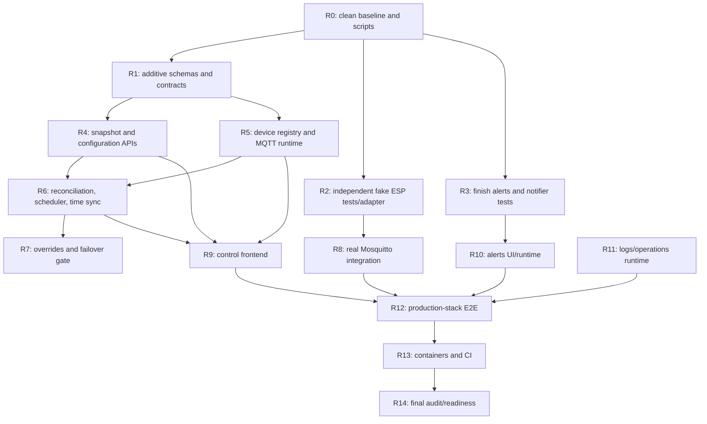

# AquariumController remaining-work plan

Updated: 2026-08-07

Purpose: execution record and handoff plan. R0-R14 repository implementation is
complete, including firmware 6.0.2, strict per-device JSON MQTT, bounded
per-device lanes, latest-only routine PWM coalescing, and device-local failure
handling. Legacy topics are passive discovery only; every pre-v6 device requires USB. The
current branch still needs protected CI, merge, default-branch validation,
image publication, and immutable digest selection. Fleet flashing and physical
firmware-6 validation remain external.

Exact counts, commit IDs, and image digests later in this document are
historical pre-4.1 evidence unless explicitly described as current. They must
not be used as the current deployment identity.

This document records the completed repository execution plan and hands off the
remaining external release work. It is deliberately more prescriptive than
`architecture.md`: future changes should preserve these decisions unless
evidence proves one unsafe.

The production aquarium, Raspberry Pi, production broker, credentials, GitHub
settings, and live production paths remain out of scope during implementation.
Operator-local legacy JSON is a production deployment input, not a repository
or CI fixture. Repository verification uses deterministic synthetic migration
fixtures; the real snapshot must be dry-run during the supervised deployment.

## 1. Completion boundary

Repository work is complete only when the only remaining actions are:

1. Pass all six protected jobs for the current branch, merge through the
   protected default branch, pass its run, publish the multi-platform image,
   smoke-test it, and record the newly selected exact digest.
2. Confirm the exposed credential was revoked, have GitHub Support purge the
   unreachable historical object/cached view, resolve its open alert as
   `revoked`, and keep secret scanning and push protection enabled.
3. Flash and identify firmware 6.0.2 on every production ESP32, then complete a
   controlled hardware/failover soak.
4. Configure the Pi's production MQTT/database/archive/backup paths and
   credentials outside the repository. The shared broker authenticates
   `aquarium/v1/#` while retaining anonymous access to other topic namespaces.
5. Preserve the legacy installation and an immutable JSON snapshot, repeat the
   importer dry-run on the Pi, record the newly calculated fingerprint, review
   the complete report, and commit only that exact snapshot into new storage
   after operator approval. Then create the candidate schema-v2 backup.
6. Set the separately required production Compose image-repository and
   `sha256`-digest inputs, deploy the selected verified image by that digest,
   run health/integrity/rollback checks, and perform the controlled cutover.
7. Configure and prove the selected real alert destination.

The following stay explicitly deferred:

- The sketch5 dashboard and its switches, countdowns, timers, and sensors.
- DSL dosing and pump-calibration workflows described only in old TODO files.
- Direct Pi sensors, USB Arduino support, remote access, Tailscale, and public
  HTTPS.
- Actual production-data migration, Pi configuration, flashing devices, and
  hardware validation.
- Kill, shutdown, reboot, git-pull, and self-update HTTP endpoints.

## 2. Non-negotiable safety rules

Every delegated task must follow these rules:

- Never contact, scan, ping, browse, or resolve aquarium/LAN devices.
- Never connect to the legacy broker at `192.168.1.73` or any host copied from
  `.old`.
- Network tests may use only loopback or a test-created Docker network.
- Running development/tests may use only `test/aquarium/*`. Production topic
  strings may appear in source and pure tests but may not be used by a test
  client.
- MQTT stays disabled by default. Production MQTT requires production mode,
  an explicit broker, the production namespace, and the exact confirmation
  guard already defined in `configuration.ts`.
- Treat legacy Python/templates and historical files under `.old/**` as
  read-only. The user explicitly promoted
  `.old/slaveCode/ESP32Code/ESP32Code.ino` into the refactor and authorized the
  firmware 6.0.x reliability/protocol changes. Do not flash hardware from repository
  implementation tasks.
- Never read or modify `.env` files. Document variables by name and ask the
  operator to set values.
- Publish only with explicit operator authorization after relevant checks pass.
  History rewriting is reserved for credential removal and must preserve
  unrelated commit history.
- Preserve unrelated user changes. Do not use destructive Git commands.
- Timeout or interrupted QoS 0 publication means actuator outcome is unknown;
  never retry blindly.
- Do not weaken a guard, validation rule, or test to make a suite pass.

## 3. Settled architecture decisions

These decisions are closed unless implementation evidence exposes a safety
problem.

### Runtime and frameworks

- Node.js 24 LTS, npm 11, strict TypeScript 5.9.
- One Fastify modular-monolith controller owns HTTP, SSE, MQTT, scheduling,
  persistence, alerts, and adapters.
- React 19 + Vite + React Router + TanStack Query provide a local SPA.
- Mosquitto remains a separate process/container.
- Zod validates every untrusted boundary and every versioned persisted JSON
  document on both write and read.
- SQLite uses Kysely and `better-sqlite3`; do not add a network database.

### Database representation

`state.db` is authoritative and relational. Devices, mapping profiles, pin
mappings, outputs, channels, schedules, points, throttles, overrides,
operations, alerts, and migration metadata are rows with constraints and
indexes. They must never be collapsed into a large JSON document.

JSON columns are limited to genuinely variable or wire-shaped documents:

- Typed event payload/details.
- Firmware metadata and compiled firmware schedule payloads.
- Versioned rule-specific configuration.
- DSL diagnostics/source metadata for the deferred extension point.
- Import reports and diagnostics.

Each JSON column must have a schema-version partner, use a specific Zod schema,
reject duplicate keys where raw JSON text enters the system, and validate again
when read. Frequently queried properties remain ordinary indexed columns.

`events.db` is separate so event retention and archive work cannot endanger
control state. Cross-database atomic commits are forbidden: a state mutation
commits its revision and outbox row in `state.db`, then the dispatcher mirrors
the event idempotently into `events.db`.

### Logging, storage, and compression

- Pino process/service logs go to stdout. Local and production Compose use
  capped, rotated, compressed container logs.
- Queryable MQTT, scheduler, retention, metadata-only backup, HTTP mutation/
  server-error, and sanitized runtime-callback interactions go to structured
  `events.db` rows through `InteractionRepository`. State events, not transport
  rows, remain authoritative for domain mutation details.
- Secrets and sensitive keys are redacted before persistence; payload hashes
  are calculated after redaction.
- Critical/audit data is durable. High-volume raw traffic has short retention,
  aggregate summaries, byte budgets, and optional archive-before-delete.
- Event archives are deterministic NDJSON compressed with Node 24 native
  Zstandard. Checksum, byte counts, schema version, and database status must be
  verified before source rows can be removed. Concurrent creation is monotonic:
  a completed winner cannot be moved back to pending/failed, and source deletion
  follows verification of that winner.
- `state.db` and `events.db` use independent SQLite online backups with a
  manifest, SHA-256, and SQLite integrity check. Restore never overwrites an
  existing path and is performed during a controlled outage.
- Backup freshness is based on full verification of the exact canonical
  `backup-<createdAt>/manifest.json` referenced by the latest successful audit
  row. Missing, corrupt, replaced, escaped, or symlinked artifacts are not
  successful backups; there is no scan/fallback to an older directory.
- Storage projection targets no more than 10 GiB/year by default. Startup and
  five-minute periodic checks feed low-disk, projection, unresolved retention,
  unresolved archive, and latest-backup-failed observations into non-reentrant
  typed alert rules. Successful maintenance clears older failure observations.

### CI and deployment

- Pull-request code never runs on a Pi runner.
- Executable CI has separate static/unit, critical, real-broker integration,
  production-browser, firmware, and amd64/ARM64 container lanes. It renders the
  production Compose template and checks that builds leave no generated source
  changes. GHCR publishing is gated to default-branch pushes and a
  nonempty explicit image repository variable.
- Those are six validation jobs. `publish-image` is a separately gated seventh
  job, not a validation lane or a Pi deployment job.
- Main may publish a multi-architecture image through a run-unique tag after
  GitHub settings are configured externally. The returned manifest digest is
  the sole immutable deployment input and is smoke-tested on both platforms.
- A future protected deploy job may run only on an explicitly configured Pi
  runner/environment and is not part of this repository-completion phase.
- Production LAN traffic is plain HTTP. Do not recreate application-managed
  certificates.

GitHub Free provides standard hosted Actions without a minutes charge for
public repositories; private repositories use the account's included quota.
Protected branches are available on Free for public repositories, while private
branch protection requires an eligible paid plan. See GitHub's official
[Actions billing](https://docs.github.com/en/billing/concepts/product-billing/github-actions)
and [protected-branch](https://docs.github.com/en/repositories/configuring-branches-and-merges-in-your-repository/managing-protected-branches/about-protected-branches)
documentation. Public visibility is not a credential-remediation mechanism.

## 4. Current repository inventory

### Implemented and locally evidenced

- R0-R2 foundation, additive migrations/contracts, and an independent fake ESP
  with command, large-message, persistence, clock, schedule, and fleet behavior.
- R3 alert rule evaluation, delay state, open/ack/recover lifecycle,
  notification intents/outcomes, history API, loopback/HTTPS-guarded webhook
  adapter, optional one-attempt notification runtime composition, and built-in
  enabled-device not-online evaluation. Automatic rule seeding and delivery
  transitions use global revision/outbox events with precise invalidations but
  do not advance the operator floor.
- R4 transactional snapshot and revision-checked channel/schedule/throttle/
  mapping/device/alert-rule mutation APIs. Channel lifecycle owns its UTC
  schedule atomically and schedule capacity validates the full wire document.
- R5 persistent device registry, health transitions, durable operation states,
  correlated request routing, bounded priority-aware per-device lanes,
  device-local timeout/protocol-fault handling, guarded MQTT composition, and
  shutdown.
- R6 deterministic per-device artifacts, hash no-op, affected-device triggers,
  per-device coalescing/failure isolation, latest-only routine PWM scheduling,
  and best-effort announce/daily time sync.
- R7 server-authoritative manual override start/extend/cancel/expire/reconcile,
  persisted exact pin targets, restart initialization, scheduler overlay, and
  typed React commands/countdown/operation states without optimistic success.
- R9 snapshot/SSE coordinator and the reusable React control surface for all 11
  retained slugs, including channel/schedule/throttle/mapping/device workflows,
  manual overrides, operation states, conflict handling, and accessible point
  forms.
- R10 stable cursor log query/export and alert history/acknowledgement APIs plus
  URL-backed Logs and Alerts pages with component tests.
- R11 Pino and durable interaction redaction, MQTT/scheduler/retention logging,
  explicit retention policy seeding, daily 03:00 UTC retention with stale-run
  recovery, deterministic cross-table event candidates in internal batches
  capped at 10,000, state-event retention, seven-day routine PWM operation
  retention, published outbox/orphan revision pruning, durable maintenance
  diagnostics, Zstd archive verification, periodic filesystem/projection/failure
  alerts, metadata-only backup/HTTP outcomes, sanitized runtime-callback errors,
  recoverable latest-backup-failure alerting, and an explicit-path storage CLI
  for backup/verify/restore/retention/archive/integrity.
- R8 uses digest-pinned Mosquitto 2.0.22 in isolated Testcontainers networks.
  Its transport/runtime suite covers the complete command/payload/fault/restart
  matrix and asserts that captured broker traffic never leaves
  `test/aquarium/*`.
- R12 runs 18 retry-free Chromium scenarios against production-built assets,
  fresh SQLite files, the real broker, and two persistent fake ESPs. It covers
  all routes, CRUD, devices, overrides, logs/alerts, accessibility, responsive
  layouts, faults, SSE recovery, and controller/fake/broker restarts.
- R13 provides the pinned multi-stage image, fail-closed production Compose,
  healthy local controller/broker/two-fake stack, compressed capped logs,
  non-root/read-only hardening, restart persistence, and amd64 plus emulated
  ARM64 HTTP/SQLite evidence.
- Firmware 4.1.0 retains the 4.0 cache, rollover, normalized-duty, and
  resolution fixes and adds correlated request IDs, controller-owned overwrite
  leases, valid-EEPROM-time fallback, best-effort per-pin schedule activation,
  and wear-limited persistent/MQTT diagnostics. It is enforced by the
  registry/reconciliation/frontend gate and keeps MQTT/manual control startup
  independent of NTP availability. Frequency/resolution pairs enforce
  `frequencyHz * 2^resolutionBits <= 80,000,000`, and sync accepts epoch seconds
  1-2,147,483,647. The real 4.1 sketch passes the pinned compiler build. The
  1,036,431-byte flash, 63,180-byte global-RAM, and 264,500-byte remaining
  figures belong only to the historical 4.0 compile.
- Migration verification uses deterministic synthetic JSON created in temporary
  directories. `.old/data` is intentionally ignored operator-local production
  input and is absent from Git, Docker build contexts, and CI. The actual source
  must be dry-run again during deployment.
- CI includes the independent static/unit, critical, integration, browser,
  firmware, container, and gated immutable-publish lanes.
- The exact backup-artifact verifier passed its focused 2026-07-19 selection:
  four files and 21/21 tests.

### Historical pre-4.1 hosted release evidence

- Historical source:
  `886ed05be89a1abed8e076d91ce2802f5d5668dd`.
- All six checks passed in protected
  [PR run 30158546118](https://github.com/AdrianNO1/AquariumController/actions/runs/30158546118)
  and protected
  [`master` run 30158994132](https://github.com/AdrianNO1/AquariumController/actions/runs/30158994132).
- Historical public multi-platform image:
  `ghcr.io/adrianno1/aquarium-controller@sha256:0629bacbd1744eafd2c98b7c96890e6bf1a5d891dc44e77bd77702da1fb2becc`.
- Keep future repository changes inside the same verification boundaries; do
  not broaden durable logging to every debug event, healthy read, or five-second
  healthy tick.
- Do not deploy the historical source or digest as the 4.1 release. The current
  merge must produce and select new protected evidence.

### Verification caveat

The host verification before fixture isolation passed 95 files/619 unit tests
and 81 files/558 critical tests, plus lint, workspace typechecks, and production
builds. The clean Linux Docker verification after fixture
isolation passed 95 files/618 unit tests and 81 files/557 critical tests with
the same static/build gates. The one-test reduction in each selection is the
intentional removal of environment-dependent `.old/data` coverage; deterministic
synthetic fixtures now provide hermetic importer coverage.

## 5. Blocker and decision gates

### Gate D1: Docker/Testcontainers — resolved

Docker Desktop 4.81.0 exposes engine 29.6.1 on Linux/amd64. Testcontainers,
Compose, amd64, and emulated ARM64 evidence all run against the real engine.
Native Mosquitto remains diagnostic-only and was not substituted for required
container evidence.

### Gate D2: deployed-firmware reliability defects — resolved in 4.1.0

The user explicitly approved firmware work. Version 4.1.0 retains the 4.0
unsigned rollover comparison, first-write, cache invalidation, and pin
bookkeeping fixes. It also trusts valid persisted time if Pi and NTP are
unreachable, echoes correlated request IDs, keeps controller writes authoritative
for the overwrite lease, activates schedule pins best effort, and persists and
announces wear-limited diagnostics. Independent fake tests cover the behavior,
and the real sketch passes its pinned compiler lane. Firmware older than 5.0.0
is visible as `firmware_unsupported` but receives no actuator work. Flashing a
supported firmware is part of the external release checklist.

### Gate D3: production legacy snapshot — external deployment gate

`.old/data` is intentionally ignored operator-local production input.
Deterministic synthetic fixtures prove importer behavior in CI, but cannot
certify the aquarium snapshot. The stopped production source must be copied,
fingerprinted, dry-run, reviewed, and committed from the same immutable copy.
Any fatal finding stops migration.

### Gate D4: exposed credential history — reachable history clean, orphan remains

Every reachable hosted branch contains only redacted sentinels with the original
commit topology preserved. GitHub still serves one unreachable historical
object directly and its secret-scanning alert remains open. Confirm revocation,
request GitHub Support garbage collection/cached-view removal, then resolve the
alert as `revoked`. Rewriting history does not invalidate public clones.

## 6. Dependency and delegation map

Solid implementation work now exists through R7 and R9-R11. The graph remains
useful as an evidence dependency map: R8/R12/R13 are not bypassed by unit tests.



Safe final-audit parallel lanes:

- Settled-tree verification and documentation can be isolated from the
  Docker-dependent lanes, with one owner for any shared composition fix.
- Documentation/readiness audit can proceed without Docker but may not invent
  integration, browser, or container results.
- R8, R12, and R13 are implemented. The current local no-retry R12 browser run
  passed 21/21; the protected PR and `master` 18/18 results are historical
  pre-4.1 evidence. Current protected confirmation and real production hardware
  remain separate external evidence.

## 7. Standard task protocol

Use one bounded Codex task per work package below. Ordinary mode is appropriate
for most packages; reserve higher reasoning (not Ultra unless the user chooses)
for R6-R8 and final safety review.

Every task prompt should begin with:

> Follow the repository instructions supplied by the operator. Read
> `docs/remaining-work-plan.md`, `docs/architecture.md`, and
> `docs/feature-parity.md`. Work only on package Rn. Never access the Pi/LAN,
> production broker/data, `.env`, or modify `.old`. Use test MQTT topics only.
> Preserve unrelated changes, update parity evidence, and run focused checks.
> Never stage, commit, or push unless the operator explicitly instructs it.

Every package must end with:

- A list of files changed and decisions made.
- Exact commands/tests run and their results.
- Relevant parity-matrix rows updated; do not claim `Implemented` without all
  listed unit, real integration, and browser evidence.
- No skipped/only tests, weakened assertions, generated DBs/logs, or secrets.
- A clear handoff. Do not stage or commit merely because checks pass; those
  actions require separate operator instruction.

## 8. Work packages

The task lists below preserve the original acceptance scope for traceability.
Read each package's **Current status** before delegating it. Completed bullets
are audit criteria, not instructions to reimplement working code. Exact
validation counts are historical where sections 1-5 say newer release evidence
is pending; sections 1-5 are authoritative for current state. The remaining
items are summarized in sections 4 and 10.

### R0 — Re-establish a clean, reproducible baseline

Current status: **implemented** for repository scripts and test-lane separation.
Final clean-source Linux evidence is owned by R14.

Effort: small. Dependencies: none. Suggested mode: ordinary.

Tasks:

- Verify Node 24/npm 11 and Docker gate D1 without contacting any remote/LAN
  service.
- From a clean checkout run `npm ci`, then `npm run check`.
- Add `@aquarium/fake-esp` to `build:packages`; ensure the lockfile contains all
  workspace links and `npm ci` does not modify it.
- Split scripts into stable lanes:
  - `test:unit`
  - `test:integration`
  - `test:e2e`
  - `test:critical`
  - `verify` (all required checks)
  - `stack:test:up`, `stack:test:down`, and `stack:test:status` later filled by
    R13.
- Update README claims that still call SQLite/MQTT “next milestone.”
- Do not rewrite the `WIP` commit. Make a new coherent baseline-cleanup commit
  if changes are needed.

Acceptance:

- Clean checkout: `npm ci` leaves Git clean.
- `npm run check` passes.
- All six workspaces typecheck/build, including fake ESP.
- Test scripts do not inadvertently run Docker or browsers in the unit lane.

### R1 — Additive runtime migrations and stable HTTP/event contracts

Current status: **implemented at unit level**. Runtime migrations, versioned
contracts, outbox envelopes, and migration/preflight tests are present.

Effort: medium. Dependencies: R0. Suggested mode: ordinary with careful schema
review.

Do not edit `001` migrations in place. Add tested `002` migrations so upgrade
from the current committed schema is evidence.

State additions to evaluate and implement:

- `device_schedule_artifacts`: device, source state revision, desired hash,
  compiled payload JSON + schema version, byte count, compile/delivery status,
  timestamps, and indexed desired/reported reconciliation fields.
- `scheduler_guards`: persisted daily UTC job key/day/last-success metadata for
  time sync and maintenance without duplicate restart bursts.
- `alert_condition_states`: persisted pending-since/last-observed condition so
  alert delays survive controller restart; replace the alert service's in-memory
  `pendingConditions` map as authority.
- `notification_deliveries`: alert transition, destination kind, status,
  attempt/dedup key, timestamps, and last error. It must not become an
  unbounded automatic retry queue.

Add or tighten indexes/checks for the actual query paths. JSON remains paired
with a positive schema version.

Define shared Zod contracts for:

- Controller snapshot and revision metadata.
- Channels, schedule points/graphs, throttles, mapping profiles, devices,
  operations, overrides, alert rules/alerts, and mutation results.
- Expected-revision conflicts and typed API errors.
- Logs list/filter/cursor/export metadata.

Contract rule: committed state SSE data uses the same versioned entity/event
schemas as HTTP invalidation. Transient stream events never consume a revision.

Acceptance:

- Empty DB migrates to latest.
- A fixture at schema `001` upgrades to `002` without data loss.
- Migration rerun is idempotent; downgrade behavior is explicit/tested where
  supported.
- Constraint, case-sensitivity, JSON-version, and index tests pass.
- Contract tests reject missing, excess, malformed, nonfinite, and unsafe
  fields.

### R2 — Complete the independent fake ESP package

Current status: **implemented at unit level**. The independent actor/fleet,
clock, persistence, command, schedule, and defect fixtures are present.

Effort: medium/large. Dependencies: R0. Suggested mode: ordinary; use higher
reasoning only for firmware-semantic review.

The fake must remain independent: it may not import controller parsers,
wire parsing, schedule compiler/evaluator/hash, or expected-response logic from
`@aquarium/esp-protocol` or `@aquarium/domain`. Shared neutral types are allowed
only if they cannot share behavior.

Tasks:

- Add comprehensive fake-actor unit tests for:
  - Discovery and announcement fields/hash.
  - `s`, `p`, `e`, `sc`, `sync`, `r`, ignored bare `clear`, rejected targeted
    `clear`, and unknown/other-target commands.
  - Batch-local indexes across multiple actors.
  - Logical pin state, analog values, configuration bounds/errors.
  - EEPROM/time and SPIFFS/schedule persistence across actor reconstruction.
  - Independent compact serialization/DJB2 results against hard-coded golden
    fixtures derived from firmware, not controller output at test time.
  - First-inclusive-link schedule evaluation, integer truncation, UTC minute
    boundaries, and resolution scaling.
  - Override extension and exact 119999/120000-ms expiry boundaries.
  - The known cached-value and 32-bit timer failover defects (gate D2):
    flat-segment override expiry, PWM reattachment, zero-target schedule
    replacement, and near-rollover override timing.
  - Complete-message 5,120/5,121-byte boundaries and malformed payloads without
    importing controller protocol behavior.
  - Delay, drop, malformed, duplicate response faults and reconnect behavior.
- Add a narrow MQTT.js transport for fake actors. It must enforce explicit test
  topics and loopback/test-Docker brokers; no production escape hatch is needed
  in this package.
- Add a launcher/harness capable of starting multiple named fake actors with
  persistent logical stores for integration/E2E.
- Add fake package build/test scripts and include it in root builds.

Acceptance:

- Independent unit/golden tests cover every firmware-observable row in the
  parity matrix.
- A source-import check or architectural test proves fake behavior code does
  not import controller/domain/protocol behavior implementations.
- Actor restart retains expected logical EEPROM/SPIFFS state.
- No test client can construct an `aquarium/*` subscription/publication.

### R3 — Complete alerts and webhook notification

Current status: **implemented at application/runtime-composition level**. Alert
lifecycle, persisted delay/delivery intent, history/acknowledgement,
one-attempt/interrupted-attempt handling, optional webhook configuration, and
ordered startup/shutdown exist. Selecting the real destination remains an
external deployment step; R11 now supplies the operational storage-source
composition.

Effort: medium. Dependencies: R0 and R1 migration for persisted delay/delivery
state. Suggested mode: ordinary.

Tasks:

- Test rule validation and each supported observation source:
  device/output/sensor/switch.
- Test threshold/condition truth tables, delay boundaries, deduplication,
  acknowledge, recovery, reopen, disabled rules, stale data, and restart during
  a pending delay.
- Make alert mutations use `commitStateChange` and emit typed/versioned outbox
  events atomically.
- Persist pending condition and notification delivery state; in-memory maps may
  cache but may not be authoritative.
- Define notifier orchestration: state commit succeeds independently of remote
  delivery; delivery failure is recorded and alertable. Do not blindly retry.
- Test `WebhookAlertNotifier` only against a test-created loopback HTTP server:
  payload schema, optional auth header, timeout, non-2xx, redaction, and
  deduplication.
- Enforce HTTPS in production. Development/test HTTP must be loopback only.
- Leave storage/retention/backup/disk failure observations to R11, where the
  system-source schema and notifier-failure recursion policy are defined with
  the operational jobs that emit them.

Acceptance:

- Focused alert and localhost notifier suites pass without WAN/LAN requests.
- Restart preserves pending delay and open/acknowledged state.
- Duplicate observations/deliveries do not spam a destination.
- Notification failure never rolls back or loses authoritative alert state.

### R4 — Snapshot, revision conflict, and configuration mutation API

Current status: **implemented at repository/HTTP/component level**. Snapshot and
all listed mutation routes exist with transactional revision/outbox tests.

Effort: large. Dependencies: R1. Suggested mode: ordinary, split into R4a/R4b
if context grows.

R4a — read model:

- Build a transactionally consistent snapshot repository returning revision,
  generated time, all 11 control-area projections, channels, schedule points,
  throttles, mappings, devices/status, active overrides, recent operations, and
  active alerts.
- Add `GET /api/snapshot` and optional scoped reads only when they reduce payload
  materially. Reads must never create defaults or mutate state.
- Zod-validate persisted JSON during projection and the complete response.

R4b — configuration mutations:

- Channel create/rename/delete and schedule-point replacement.
- Per-type throttle update.
- Mapping-profile and pin-mapping replacement.
- Device desired name/frequency/resolution update.
- Alert rule CRUD/enablement and alert acknowledgement.

Use `expectedRevision` optimistic concurrency on every operator-owned
authoritative mutation. Validate it inside the same SQLite transaction as the
change against a serialized operator-commit floor, not by requiring equality
with the global SSE revision: background runtime commits must not invalidate an
otherwise current operator draft. Each real operator change creates exactly one
global state revision/outbox event and advances the operator floor; a no-op must
consume neither. The browser pins the snapshot token on first draft interaction
and requires an explicit rebase after a conflict instead of silently submitting
the latest live revision with old form data.

Suggested endpoints (names may be adjusted once, then frozen):

- `GET /api/snapshot`
- `PUT /api/control-areas` (atomic area-manager save)
- `PUT /api/control-areas/:areaSlug/channels` (atomic channel-manager save)
- `PUT /api/control-areas/:areaSlug/schedule-configuration` (atomic schedules
  and multiplier save)
- `POST /api/channels`
- `PATCH /api/channels/:channelId`
- `DELETE /api/channels/:channelId`
- `PUT /api/channels/:channelId/schedule`
- `PUT /api/throttles/:typeKey`
- `PUT /api/mapping-profiles/:profileId`
- `PATCH /api/devices/:deviceId/configuration`
- `GET /api/operations/:operationId`
- `GET/POST/PATCH /api/alert-rules...`
- `POST /api/alerts/:alertId/acknowledge`

Mapping validation must require a known hardware profile and reject duplicate
pins/channels or pins outside that profile's PWM allowlist. Device/profile
association is explicit and independent of the device name. Schedule validation
must report all graph errors and enforce conservative serialized payload
capacity.

Acceptance:

- Fastify injection tests cover success, bad body/params, missing entity,
  revision conflict, relational conflict, no-op, and atomic rollback.
- CRUD persists across database reopen.
- Case-distinct names remain distinct.
- Every returned body and stored JSON document passes its Zod contract.
- Snapshot revision + SSE-after-revision race is tested end to end at the
  controller layer.

### R5 — Persistent device registry and MQTT runtime composition

Current status: **implemented at unit/runtime-composition level**. Registry,
operations, MQTT composition, safety guards, interaction logging, and shutdown
exist; real-broker evidence belongs to R8.

Effort: large. Dependencies: R1 and stable MQTT transport. Suggested mode:
higher reasoning.

Tasks:

- Implement announcement use case: upsert by hardware ID, preserve desired vs
  reported configuration, record firmware hardware profile/model, update
  status/last seen/firmware/hash, clear or set typed errors, and emit a state
  revision only for authoritative visible changes. Repeated identical
  announcement may update last-seen according to an explicit event-volume
  policy without flooding SSE.
- Track connection status separately from command attempt/outcome. Add stale and
  offline transitions driven by injected time.
- Wire `LegacyMqttTransport` into a runtime/composition object with deterministic
  start/stop order. Remove the deliberate `server.ts` MQTT-enabled throw only
  when registry, logging, and shutdown are wired.
- Route transport interactions through `InteractionRepository` with redaction,
  topic/device/correlation/operation metadata, outcome, bytes, and duration.
- Convert each hardware mutation into a persistent `control_operations` state
  machine: pending -> in-flight -> succeeded/failed/timed-out/outcome-unknown.
- On outcome unknown, retain desired intent separately, do not update observed
  state, mark the affected device offline, and apply its bounded cooldown.
  Healthy device lanes remain available; never blindly retry the ambiguous
  operation.
- Implement typed command builders/expected responses for `s`, `p`, `e`, `sc`,
  `sync`, and `r`. Firmware must ignore bare `clear`; remote fleet-wide EEPROM
  erasure is not an acceptable maintenance interface.
- Ensure callbacks cannot crash the MQTT loop and shutdown waits for safe local
  teardown without inventing command outcomes.

Acceptance:

- Unit/in-memory tests cover new/repeated/malformed/delayed announcements,
  device restart, stale/offline/recovery, and DB restart.
- Command operation tests cover every terminal state and prove no blind retry.
- Server can start with MQTT disabled and with an explicitly guarded test broker
  configuration. It still cannot accidentally use production topics in tests.

### R6 — Schedule artifacts, reconciliation, refresh scheduler, and time sync

Current status: **implemented at unit/runtime-composition level**. Artifact,
trigger, reconciliation, five-second refresh, daily/announce time sync, and
diagnostic paths exist; real-broker evidence belongs to R8.

Effort: large. Dependencies: R4 and R5. Suggested mode: higher reasoning.

Tasks:

- Project normalized channels/points/throttles/mappings into validated domain
  graphs, then compile deterministic per-device legacy schedule artifacts.
- Map domain output to protocol keys/type codes without moving domain policy
  into `esp-protocol`.
- Persist compiled payload, schema version, byte count, desired hash, source
  revision, and delivery status. Hash excludes `syncTime`; the send payload adds
  current epoch seconds in the established key order.
- Enforce 4095 bytes as the conservative safe C-string maximum even though the
  nominal buffer is 4096.
- Reconcile on each independent trigger: schedule, point, throttle, mapping,
  desired device configuration, and announcement hash mismatch.
- Coalesce superseded work by device. Hash equality is a no-op. Preserve the
  legacy exclusion for firmware `0`, `1`, and `2w` as an explicit unsupported
  state/error.
- Implement the five-second scheduler with injected monotonic/UTC clocks:
  - one active device batch and at most one latest-only pending routine batch per
    device;
  - no catch-up command burst;
  - evaluate every active mapped output at UTC minute;
  - apply throttle and explicit mapping/output gain using half-even rounding;
  - resend unchanged values every five seconds as legacy safety refresh;
  - send normalized 0-255 wire duty; firmware scales it into the configured
    1-16-bit range, and resolution reattachment rescales scheduled/current-
    overwrite caches plus physical output;
  - reject frequency/resolution pairs when
    `frequencyHz * 2^resolutionBits > 80,000,000`.
- Implement time sync after announcement and once daily at 05:00 UTC using the
  persisted daily guard. Schedule `syncTime` must never be mistaken for `sync`.
- Make schedule/config delivery and refresh operations use bounded,
  priority-aware per-device lanes and persistent operation states. Keep one
  response-waiting operation per ESP, select interactive work before queued
  background work, and publish each complete command atomically.

Acceptance:

- Unit/property tests cover all UTC minutes, rising/falling/flat, wrap, 0/50/100
  throttles, 0.7 gain, Python rounding, mapping isolation, capacity/hash, and
  affected-device selection.
- Fake-clock tests cover exact five-second cadence, overtime/no overlap,
  restart, and 05:00 UTC/DST independence.
- Reconciliation tests cover hash no-op, supersession, old firmware,
  partial/mismatch, dropped response, and outcome unknown.

### R7 — Manual overrides and failover decision

Current status: **implemented with current local evidence**. Service, repository,
routes, scheduler overlay, restart, expiry, unknown outcome, typed
start/extend/cancel/reconcile UI, authoritative countdown/states, conflict
refresh, no-optimistic-retry, and firmware failover evidence exist.
Current local full integration and browser coverage pass; protected CI
confirmation remains pending.

Effort: medium plus decision gate. Dependencies: R2, R5, R6. Suggested mode:
higher reasoning.

Tasks:

- Add API/service operations to start, extend, cancel, expire, and reconcile a
  temporary channel/output override. Server time is authoritative.
- Persist requested/start/expiry/completion/operation state atomically.
- On active override, scheduler sends the override PWM with firmware overwrite
  flag. Normal host refresh also preserves the deployed five-second/120-second
  safety contract.
- Treat dropped response as unknown; do not optimistically claim pin state or
  retry.
- Reconcile server restart using persisted expiry and device observation where
  protocol permits.
- Run the independent fake tests that expose exact expiry behavior and gate D2.

Acceptance (completed):

- 119999/120000-ms, extension, cancel, scheduled/unscheduled pins, controller
  stop/restart, and unknown outcome tests pass.
- Old-firmware behavior is pinned by compatibility fixtures; corrected 4.1.0
  behavior is pinned separately and compiled from the real sketch.
- Old/unexpected firmware is visible but excluded from actuator work until the
  operator flashes the current 6.0.2 release.

### R8 — Real pinned-Mosquitto integration suite

Current status: **implemented**. The isolated, digest-pinned Mosquitto harness
covers the required matrix and captures both allowed and forbidden namespaces.
The current local suite includes cross-device progress and single-message
publication through the 5,120-byte command limit. Protected CI confirmation
remains pending.

Effort: large. Dependencies: D1, R2, R5-R7. Suggested mode: higher reasoning.

Use Testcontainers with a pinned Mosquitto 2.0 image/digest and independent
MQTT.js fake actors. Broker mocking or mocked `publish` is not integration
evidence.

Build a reusable harness with:

- A test-created network/broker and dynamically allocated loopback port.
- Explicit `test/aquarium/*` assertions on every client, publication, and
  subscription.
- Multiple fake actors with independent persistence and fault controls.
- Deterministic teardown with no leaked containers/clients.

Required cases:

- Discovery, multiple devices, duplicate/malformed/delayed announcements,
  reconnect, fake restart, controller restart, and broker restart.
- Every command/response behavior including ignored bare `clear`, rejected
  targeted `clear`, and analog read.
- 5,120/5,121 UTF-8 command boundaries plus the 4095/4096 schedule
  boundary.
- Per-device FIFO ordering, one response wait per ESP, bounded cross-device
  concurrency, complete-message publication, and canonical name/ID batching.
- Batch-local indexes across multiple devices.
- Dropped/delayed/duplicate/malformed responses, device-local timeout/cooldown,
  attributable protocol-fault quarantine, reconciliation, and proof of no
  actuator retry.
- Golden compiler/hash and independent fake evaluation.
- Five-second refresh, override expiry/failover behavior, persistence after
  actor/controller/database restart, and time sync.

Acceptance:

- Integration suite passes without WAN/LAN traffic.
- Namespace-capture assertion proves zero `aquarium/*` network traffic.
- Critical integration subset passes once here and three consecutive times in
  R14 without retry wrappers.

### R9 — Functional control frontend for every retained route

Current status: **implemented**. All 11 routes,
snapshot/SSE state, schedule/channel/throttle/mapping/device editing, conflicts,
manual-override mutations/countdown/terminal states, and operation states exist.
The current production-built local Playwright suite passes 21/21; protected CI
confirmation remains pending.

Effort: large. Dependencies: stable R4-R7 contracts. Suggested mode: ordinary,
split by component rather than route duplication.

Tasks:

- Replace the current shell with typed control-area definitions for all 11
  slugs: `lights`, `pumps`, `testlights`, `bad`, `loft`, `biljard`, `frag`,
  `qt1`, `qt2`, `qt3`, `qt4`.
- Implement snapshot bootstrap then SSE-after-revision. Buffer/replay state until
  stream-ready, ignore duplicates, detect gaps/heartbeat staleness, refetch on
  forced resync, and invalidate exact TanStack Query keys for committed events.
- Build reusable `ControlPage`, channel list, schedule editor, throttle control,
  manual override panel, mapping editor, device cards/config dialog, operation
  status, alert banner, loading/empty/error/offline/stale states.
- Schedule editor supports channel create/rename/delete; point add/drag/form
  edit/delete; UTC axis; dirty state; full validation; save conflict; discard;
  responsive keyboard-accessible interaction. Pointer dragging must have a
  keyboard/form equivalent.
- Device configuration shows desired vs reported name/frequency/resolution,
  firmware/hash, last seen, errors, and pending/failed/timed-out/unknown outcome.
- Manual overrides show server-derived remaining time and never optimistically
  report actuator success.
- Remove the placeholder `/admin` route/nav unless it becomes a narrowly safe
  diagnostics surface. Never add OS/deployment controls.
- Bundle all assets locally; no CDN, fonts, analytics, or external requests.

Acceptance:

- Component/reducer tests cover every editor mutation and state-machine branch.
- All 11 direct routes render seeded data and survive reload.
- Invalid routes show a useful 404; Home/Back/navigation and keyboard focus work.
- Pending/success/failed/timed-out/outcome-unknown/stale/offline states use text
  or icons, not color alone.
- Responsive layouts work at phone, tablet, and desktop widths.

### R10 — Logs and alerts frontend/API completion

Current status: **implemented at API/component level**. Query/export/history/
acknowledgement routes and Logs/Alerts pages have focused tests; production
browser evidence remains in R12.

Effort: medium. Dependencies: R3, R4, storage primitives. Suggested mode:
ordinary.

Logs API:

- Cursor pagination with stable `(occurred_at_ms, id)` ordering.
- Filters for time range, direction, kind, severity, device, operation,
  correlation, outcome, and retention class.
- Bounded page sizes, summaries, payload visibility/redaction, and typed errors.
- Streaming or bounded NDJSON/CSV export that never scans unbounded logs into
  memory. Export reads only validated/redacted persisted data.
- If machine-readable export authentication is added, keep it explicit and
  configuration-driven; do not put a production secret in source or `.env`.

Logs UI:

- URL-backed filters, paginated table/cards, detail disclosure, refresh,
  loading/empty/error states, summary, and inspected export download.

Alerts UI:

- Active/open/acknowledged/recovered views, severity, source, timing, details,
  acknowledgement, notification delivery failure, and recovery.
- Rule editor only for the implemented safe condition model; do not expose raw
  executable expressions.

Acceptance:

- Query/cursor boundary, redaction, export content/disposition, and large-page
  tests pass.
- Browser tests cover URL filter persistence, pagination, detail, export, alert
  acknowledge/recovery, empty/error states, and accessibility.

### R11 — Runtime operations: retention, backup, restore, and disk alerts

Current status: **implemented**. Historical settled-tree verification is
recorded; current protected verification remains part of release selection.
Retention policies/scheduler/recovery, interaction
redaction/logging, state-event and routine PWM retention, outbox/orphan-revision
pruning, durable maintenance diagnostics, archives, usage projection, and the
storage CLI exist. Retention iterates deterministic interaction/aggregate/state-
event candidates in configurable internal batches capped at 10,000. Periodic
minimum-free-space, projected-year, unresolved retention-failure, unresolved
archive-failure, and latest-backup-failed observations open/recover typed alerts.
Backup attempts and HTTP mutation/server-error outcomes record metadata only;
runtime callback errors store only sanitized class/name. Detached writes drain
before the events database closes.
Concurrent archive creators preserve a single monotonic completed winner. Backup
freshness now verifies the exact canonical schema-v2 artifact instead of trusting
a historical success row; the focused four-file selection passes 21/21.

Effort: medium. Dependencies: R3 and existing storage primitives. Suggested
mode: ordinary.

Tasks:

- Wire `InteractionRepository` to MQTT, scheduler, HTTP mutations, frontend
  mutation audit, device lifecycle, alerts, retention, backup, and controller
  errors.
- Seed explicit retention policies and document their time/byte budgets.
- Schedule retention/aggregation/archive jobs with injected clock and persisted
  non-overlap guard. A failed job remains visible and never deletes source data.
- Define an explicit event-volume policy for repeated still-true alert
  observations, and bound published `state_outbox` history together with the
  SSE replay floor/gap contract. Never delete an unpublished row or let pruning
  make a missing revision look contiguous.
- Add disk-space and annual-ingest projection checks; send observations to the
  alert service.
- Add safe CLIs/scripts:
  - backup both DBs to an explicit directory;
  - verify manifest/checksum/integrity;
  - restore to new, nonexistent paths;
  - run retention once;
  - verify/decode an archive;
  - database integrity diagnostics.
- Never infer a production path or overwrite a live DB. Document controlled
  outage and rollback sequence.
- Configure Pino redaction and stable structured fields. Do not duplicate every
  debug line into durable `events.db`.

Acceptance:

- Local demo proves logging, redaction, aggregation, archive round trip,
  corruption rejection, budget deletion, backup, restore, and alert open/recover.
- Restored DBs migrate/open and contain expected state/events.
- Retention/archive/backup failure leaves authoritative data intact.
- Missing backup source files fail before a database can be created as a side
  effect; simultaneous backup/diagnostic failure surfaces both errors.

### R12 — Production-built full-stack Playwright E2E

Current status: **implemented**. The current local branch passes the retry-free
21/21 Chromium suite against production builds, real Mosquitto, fresh SQLite
files, and two persistent fake actors. The historical pre-4.1 protected PR and
`master` runs also passed 18/18; current protected confirmation remains pending.

Effort: large. Dependencies: D1 and R3-R11. Suggested mode: higher reasoning for
harness, ordinary for cases.

Create a harness that starts:

- Production-built React assets served by Fastify with SPA fallback.
- Fresh real `state.db` and `events.db` files.
- Pinned Mosquitto container.
- Multiple independent fake ESP MQTT clients.
- Only loopback/test-Docker networking and test topics.

Seed via repositories/import test fixture, not production data. Browser must
make no external requests.

Required browser coverage:

- Home/nav/all control routes/direct reload/invalid route/responsive layout.
- Channel/schedule/point CRUD, throttle, mapping, device edit, override.
- Pending, success, failure, timeout, outcome unknown, stale/offline, conflict,
  and recovery.
- Snapshot-to-SSE race, reconnect/replay, duplicate/gap/resync, stale watchdog,
  server restart, and persisted UI recovery without manual reload.
- Logs filters/pagination/export and alerts acknowledgement/recovery.
- Controller/database/fake restart persistence.
- Keyboard operation and automated axe checks on representative pages/states.
- No console errors, unhandled rejections, failed assets, or external requests.

Acceptance:

- Tests run against production builds, not Vite dev server or mocked APIs.
- Trace/screenshot artifacts are retained only on failure.
- No flaky retries conceal product races.

### R13 — Docker, Compose, local stack, and CI

Current status: **repository implementation complete; current hosted validation
pending**. The multi-stage image, production single-origin serving, fail-closed
production template, amd64/read-only/restart checks, test-topic capture, and
emulated ARM64 migration/HTTP smoke have historical pre-4.1 evidence.
Executable integration, browser, firmware, container, and guarded
immutable-publish CI lanes exist. The current branch still needs its protected
run, merge, new publication, and exact-digest smoke/selection.

Effort: medium/large. Dependencies: D1 and R8/R12. Suggested mode: ordinary
with careful operations review.

Container artifacts:

- Multi-stage production Dockerfile for Node 24 and native
  `better-sqlite3`, running as non-root with a read-only application filesystem
  and explicit writable data/archive/backup volumes.
- Production-built web assets served by controller; no separate dev server.
- Pinned Mosquitto configuration/image and health check.
- Controller HTTP/DB/MQTT health checks that distinguish readiness from liveness.
- A test/local Compose profile that launches controller, Mosquitto, and at least
  two fake ESPs using only test topics.
- A production template that contains no implicit broker/DB settings and cannot
  start production MQTT without all interlocks.
- Capped compressed Docker logging and resource/restart policies suitable for a
  Pi. Do not horizontally scale the controller.

Document one command that starts the complete local stack and stable local
service URLs/data paths.

Six CI validation jobs:

1. `static-unit`: checkout, Node 24, `npm ci`, format, lint, typecheck, unit,
   production build.
2. `critical`: the high-value contract/domain/protocol/fake/controller suite.
3. `integration`: Docker health precheck, real Mosquitto/Testcontainers suite,
   namespace-safety assertion.
4. `browser`: install pinned Chromium, build/start full stack, Playwright + axe,
   upload failure artifacts.
5. `firmware`: compile firmware 6.0.2 with the pinned Arduino toolchain.
6. `container`: BuildKit build, local amd64 smoke, ARM64 build/emulation smoke,
   Compose health, non-root/read-only/volume checks.

Separately gated publication job:

1. `publish-image` on the protected default branch only: run-unique multi-arch GHCR publication,
   exact digest capture, and amd64/ARM64 smoke from that digest after external
   GitHub permissions are configured.

Do not add a Pi deploy job that can run on pull requests. A protected deployment
workflow may be documented but remains disabled until the external runner,
environment, approvals, secrets, backup path, and rollback policy exist.

Acceptance:

- `docker buildx build --platform linux/arm64` succeeds locally and the image
  starts under emulation sufficiently for HTTP/DB migration health.
- Compose stack becomes healthy, survives controller restart, and preserves DB
  and fake-device state.
- Captured broker traffic contains no production namespace.
- CI uses `npm ci`; no generated artifacts or secrets enter Git.

### R14 — Migration/operations documentation and final readiness audit

Current status: **repository implementation and documentation complete; release
selection open**. Historical clean-source, repeat-stability,
Compose/preflight, ARM64, and hosted evidence is recorded. Current protected
CI, merge, publication, and exact-digest selection come next; production
migration, firmware flashing, and Pi validation remain operator actions after
that.

Effort: medium. Dependencies: every previous package and D2 resolution.
Suggested mode: higher reasoning review.

Documentation must cover:

- Accurate README and architecture/package map.
- Every configuration variable, default, production-required value, and safety
  interlock without secret examples.
- Local install, start/stop/status, complete stack, test lanes, and diagnostics.
- Data locations, schemas, JSON policy, logging/redaction, retention budgets,
  Zstd archives, disk alerts, backup, integrity check, restore, and rollback.
- Legacy migration dry-run/report/commit command, duplicate handling, invalid
  data stop policy, backup prerequisites, and production execution checklist.
- MQTT failure modes, outcome unknown/reconciliation, stale/offline behavior,
  schedule capacity/hash, old-firmware exclusion, and failover decision.
- Future Pi deployment by immutable digest, protected environment, health check,
  rollback, and remaining external steps.

Final audit:

- Update every parity row with exact implementation and unit/integration/browser
  evidence. No retained row may be Not started/Partial/Blocked when declaring
  complete; if D2 is accepted rather than fixed, readiness report must say why
  the replacement is not fully safety-equivalent.
- Search for placeholders, TODO/FIXME, skipped/only tests, unsafe routes, external
  assets, production topic defaults, hard-coded legacy hosts, unversioned JSON,
  and unbounded queries/queues.
- From a clean checkout run `npm ci` and the documented full verification.
- Run the critical real-broker/full-stack suite three consecutive times with no
  retries.
- Demonstrate restart persistence, SSE resync, logs, retention, compression,
  backup/restore, alerts, storage budget, and ARM64 artifact locally.
- Record the external Pi checklist without contacting the Pi.

Create `docs/readiness-report.md` containing:

- Retained features and exact tests.
- Intentional deviations and safety rationale.
- Exact commands/results and three-repeat evidence.
- Local URLs, fake devices, DB/archive/backup paths.
- Image/platform/digest information.
- Remaining external production/GitHub/Pi/alert-destination tasks.

## 9. Feature-to-package traceability

| Parity feature                     | Primary packages                     | Completion evidence                           |
| ---------------------------------- | ------------------------------------ | --------------------------------------------- |
| 1. Home/navigation                 | R9, R12                              | Web unit + all-route Playwright               |
| 2. All control pages               | R4, R9, R12                          | API projection + 11-route Playwright          |
| 3. UTC graph/interpolation         | Existing domain, R2, R9              | Unit/property + independent fake + editor E2E |
| 4. Channel/point editing           | R4, R9, R12                          | Transaction/reducer/browser CRUD              |
| 5. Throttles                       | R4, R6, R9                           | Rounding/isolation/recompile/browser          |
| 6. Temporary overrides             | R7, R9, R12                          | Boundary/unknown/restart/browser              |
| 7. Mappings                        | R4, R6, R9                           | Hardware pins/explicit assignment/browser     |
| 8. Discovery/registry              | R2, R5, R8                           | Real broker + restart/persistence             |
| 9. ESP configuration               | R2, R4, R5, R8, R9                   | Fake EEPROM + operation states + browser      |
| 10. Compile/syncTime/hash          | Existing domain/protocol, R2, R6, R8 | Golden/capacity/restart/hash                  |
| 11. Schedule triggers              | R4, R6, R8                           | Each mutation, coalescing, unknown            |
| 12. Five-second refresh            | R6, R8                               | Fake clock + real broker + restart            |
| 13. 120-second failover            | R2, R7, D2                           | Exact boundary + controller death + decision  |
| 14. Time synchronization           | R2, R6, R8                           | Announce/daily/restart/DST-independent        |
| 15. MQTT serialization/correlation | Existing transport, R2, R5, R8       | Pure/unit + real broker                       |
| 16. Logs                           | Existing storage, R10-R12            | Query/export + browser                        |
| 17. Failure/pending/stale UI       | R5-R7, R9, R12                       | State machines + faulted E2E                  |

## 10. Quota-conscious execution order

Execution status:

1. R0-R14 repository implementation is complete on the current branch.
2. Firmware 6.0.2 and focused transport/scheduler/compiler evidence pass locally.
3. The pre-4.1 baseline historically passed real-Mosquitto 5/5, Playwright
   18/18 in three retry-free runs, 97 files/638 unit tests, 82 files/571
   critical tests, and protected PR/default-branch validation.
4. D2 is resolved by firmware 4.1.0 and exact-version exclusion; the earlier
   4.0 cache and rollover fixes remain part of 4.1.
5. Docker/Compose, the six validation lanes, and immutable publication are
   implemented. The current branch still needs protected validation, merge,
   publication, smoke, and selection of a new digest.
6. Credential/support cleanup, production data, fleet flashing, and Pi work
   remain external after current release selection.

To minimize wasted turns:

- Give each task one package and its explicit acceptance list; do not ask a
  lower-cost task to “finish the whole rewrite.”
- Start each task by inspecting the current package and relevant tests; do not
  redo the legacy audit or architecture choice.
- Prefer focused tests during implementation and run `npm run check` once per
  coherent package.
- Avoid new dependencies unless the remaining package truly needs one; the
  current lockfile already contains Testcontainers, Playwright, and axe.
- Do not spend browser/container quota before API contracts and runtime behavior
  are stable.
- Stop on a repeated external prerequisite, safety ambiguity, or production
  behavior decision; report it instead of inventing a fallback.

The original quota guidance remains useful for future changes: keep tasks
bounded by one harness or surface, prefer focused checks during implementation,
and stop on genuine external or safety blockers rather than inventing fallbacks.

## 11. Operator commands: present versus planned

These commands exist now:

```sh
npm ci
npm run check
npm run test:unit
npm run test:critical
npm run test:integration
npm run test:e2e
npm run verify
docker build --file firmware/esp32/Dockerfile.compile --tag aquarium-esp32-compile:6.0.2 .
npm exec -- tsx apps/controller/src/infrastructure/import/legacy-import-cli.ts --source <explicit-directory>
npm exec -- tsx apps/controller/src/infrastructure/import/legacy-import-cli.ts --source <explicit-directory> --commit --state-db <explicit-state.db>
npm run storage -- backup --state-db <existing-state.db> --events-db <existing-events.db> --destination <backup-parent-directory>
npm run storage -- verify-backup --manifest <backup-directory/manifest.json>
npm run storage -- integrity --state-db <existing-state.db> --events-db <existing-events.db>
npm run storage -- retention --events-db <existing-events.db> --archive-dir <archive-directory>
npm run storage -- verify-archive --events-db <existing-events.db> --archive-dir <archive-directory> --archive-id <archive-id>
npm run storage -- verify-archive-set --events-db <existing-events.db> --archive-dir <archive-directory> --output <new-archive-set-manifest.json>
npm run storage -- decode-archive --archive-file <archive.ndjson.zst> --output <new-output.ndjson>
npm run storage -- restore --manifest <backup-directory/manifest.json> --state-db <new-state.db> --events-db <new-events.db>
```

`stack:test:up`, `stack:test:status`, and `stack:test:down` now operate the
production-built frontend/controller, both SQLite databases, pinned Mosquitto,
and two persistent fake ESP actors. The local profile is isolated to
`test/aquarium/*` and preserves its named volumes across ordinary down/up and
controller/fake recreation.

The import CLI requires an explicit `--source` and defaults to dry-run. Commit
mode additionally requires an explicit `--state-db`; it must never infer a
production path. Restore must run during a controlled outage and target new
files.
